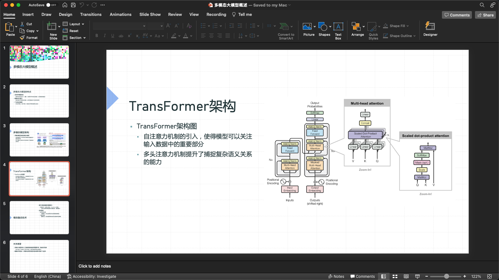

# ChatPPT

ChatPPT 是一个基于多模态 AI 技术的智能助手，旨在提升企业办公自动化流程的效率。它能够处理语音、图像和文本等多种输入形式，通过精确的提示工程和强大的自然语言处理能力，为用户生成高质量的 PowerPoint 演示文稿。ChatPPT 不仅简化了信息收集和内容创作过程，还通过自动化的报告生成和分析功能，帮助企业快速、准确地完成各类汇报和展示任务，从而显著提升工作效率和业务价值。

### 主要功能

- **多模态输入支持**：支持语音、图像、文本等多种输入形式，灵活适应用户的使用需求。
- **自动生成演示文稿**：基于输入内容，自动生成结构化的 PowerPoint 演示文稿，支持多种布局和模板。
- **语音识别和文本转换**：自动将语音输入转化为文本，进行内容处理和文稿生成，降低用户的操作成本。
- **图像处理与嵌入**：支持将用户上传的图片自动嵌入演示文稿中，并根据内容智能选择合适的布局。
- **多语言支持**：结合 OpenAI 模型和其他语言模型，支持中英文等多语言的演示文稿生成和报告输出。
- **可视化界面**：通过 Gradio 实现简洁易用的图形化界面，让用户无需复杂配置即可快速生成演示文稿。

### 产品截图

**自动生成的演示文稿内容**


## 快速开始

### 1. 安装依赖

首先，安装所需的依赖项：

```sh
pip install -r requirements.txt
```

### 2. 配置应用

编辑 `config.json` 文件，以设置输入模式、默认模板（PPT 母版）以及对应的布局映射，确保模板文件 `StandardTemplate.pptx` 中的母版布局名称与 `config.json` 中的名称一致。例如：

```json
{
    "input_mode": "text",
    "default_template": "templates/StandardTemplate.pptx",
    "layout_mapping": {
        "Title Only": 1,
        "Title and Content": 2,
        "Title and Picture": 3,
        "Title, Content, and Picture": 4
    }

}
```

### 3. 如何运行

您可以通过命令行模式运行 ChatPPT：

```sh
python src/main.py test_input.md
```

通过此模式，您可以手动提供 PowerPoint 文件内容（格式请参考：[ChatPPT 输入文本格式说明](docs/ppt_input_format.md)），并按照配置的 [PowerPoint 模板](templates/StandardTemplate.pptx),生成演示文稿。

## 贡献

我们欢迎所有的贡献！如果你有任何建议或功能请求，请先开启一个议题讨论。你的帮助将使 ChatPPT 变得更加完善。

## 许可证

该项目根据 MIT 许可证进行许可。详情请参见 [LICENSE](LICENSE) 文件。

## 联系

项目作者: Django Peng

项目链接: https://github.com/DjangoPeng/ChatPPT