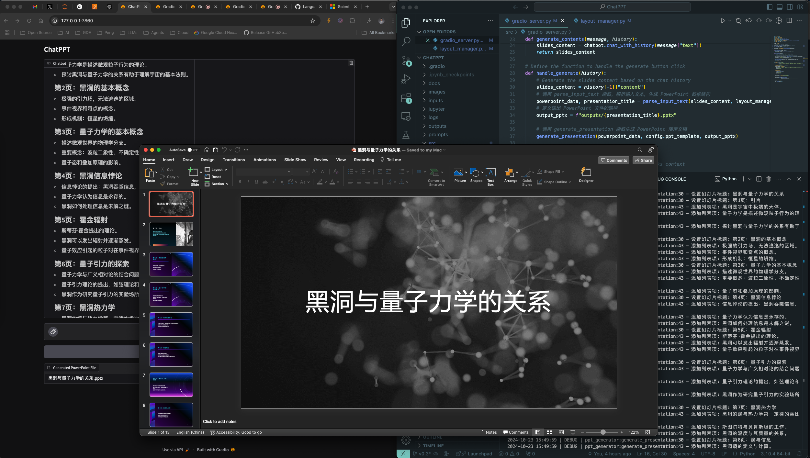

# ChatPPT

ChatPPT 是一个基于多模态 AI 技术的智能助手，旨在提升企业办公自动化流程的效率。它能够处理语音、图像和文本等多种输入形式，通过精确的提示工程和强大的自然语言处理能力，为用户生成高质量的 PowerPoint 演示文稿。ChatPPT 不仅简化了信息收集和内容创作过程，还通过自动化的报告生成和分析功能，帮助企业快速、准确地完成各类汇报和展示任务，从而显著提升工作效率和业务价值。

### 主要功能

- **多模态输入支持**：支持语音、图像、文本等多种输入形式，灵活适应用户的使用需求。
- **自动生成演示文稿**：基于输入内容，自动生成结构化的 PowerPoint 演示文稿，支持多种布局和模板。
- **语音识别和文本转换**：自动将语音输入转化为文本，进行内容处理和文稿生成，降低用户的操作成本。
- **图像处理与嵌入**：支持将用户上传的图片自动嵌入演示文稿中，并根据内容智能选择合适的布局。
- **多语言支持**：结合 OpenAI 模型和其他语言模型，支持中英文等多语言的演示文稿生成和报告输出。
- **可视化界面**：通过 Gradio 实现简洁易用的图形化界面，让用户无需复杂配置即可快速生成演示文稿。

### 产品截图



**自动生成的演示文稿内容**


## 快速开始

### 1. 安装依赖

首先，安装所需的依赖项：

```sh
pip install -r requirements.txt
```

### 2. 配置应用

编辑 `config.json` 文件，以设置输入模式、默认模板（PPT 母版）以及 ChatBot Prompt，确保模板文件 `MasterTemplate.pptx` 中的母版布局名称符合[PowerPoint 母版布局命名规范](#powerpoint-母版布局命名规范)。


```json
{
    "input_mode": "text",
    "chatbot_prompt": "prompts/chatbot.txt",
    "ppt_template": "templates/MasterTemplate.pptx"
}
```

### 3. 如何运行

#### A. 作为 Gradio 服务运行

要使用 Gradio 界面运行应用，允许用户通过 Web 界面与该工具交互：

```sh
python src/gradio_server.py
```

#### 命令行方式运行

您可以通过命令行模式运行 ChatPPT：

```sh
python src/main.py test_input.md
```

通过此模式，您可以手动提供 PowerPoint 文件内容（格式请参考：[ChatPPT 输入文本格式说明](docs/ppt_input_format.md)），并按照配置的 [PowerPoint 模板](templates/MasterTemplate.pptx),生成演示文稿。

## PowerPoint 母版布局命名规范

为确保 ChatPPT 能正确匹配布局，PowerPoint 母版文件 （[PowerPoint 模板](templates/MasterTemplate.pptx)） 中的布局名称应遵循以下命名规范：

- 布局名称应以 `{type}, {type}, {type} {No.}` 的形式命名，其中 `{type}` 是内容类型，如 `Title`, `Content`, `Picture`，例如：
  - `Title 0`
  - `Title, Content 1`
  - `Title, Picture 5`
  - `Title, Content, Picture 2`
  
- 布局名称的顺序和数量必须与输入内容一致（例如，具有标题、要点和图片的幻灯片应映射到 `Title, Content, Picture` 布局）。
- 布局后缀 `{No.}` 用于表示同类布局中的不同编号，以支持多种同类布局。
  
该规范确保布局匹配的灵活性，同时支持多种不同内容的组合和扩展。

### 4. 贡献

我们欢迎所有的贡献！如果你有任何建议或功能请求，请先开启一个议题讨论。你的帮助将使 ChatPPT 变得更加完善。

### 5. 许可证

该项目根据 **Apache 2.0** 许可证进行许可。详情请参见 [LICENSE](LICENSE) 文件。

### 6. 联系

项目作者: Django Peng

项目链接: https://github.com/DjangoPeng/ChatPPT
