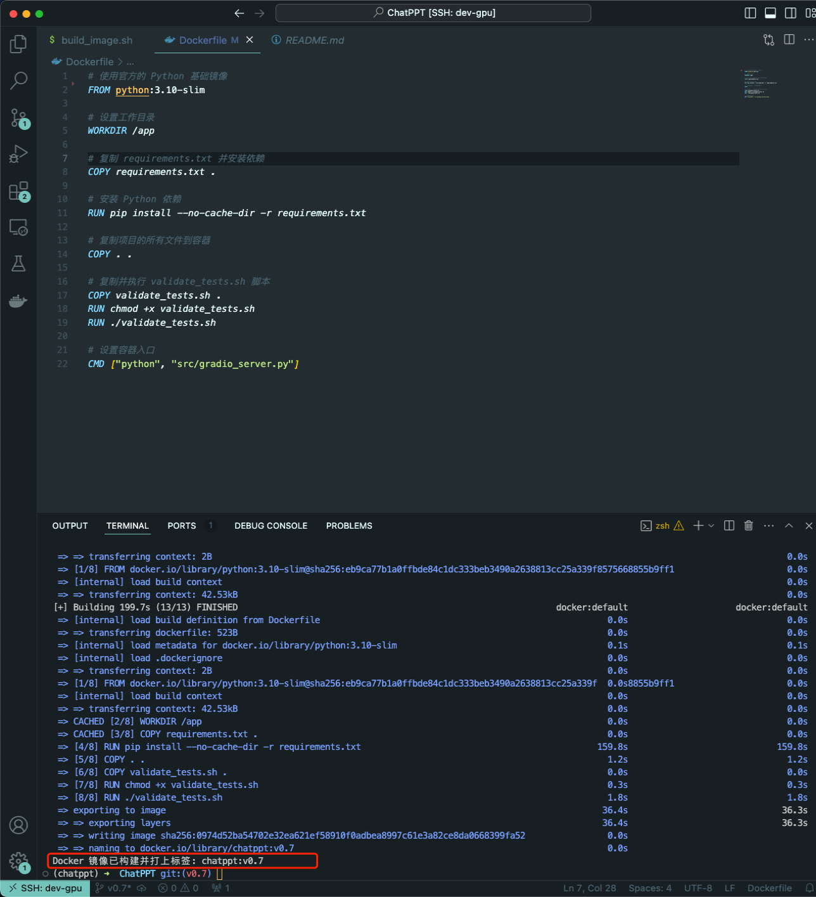

# ChatPPT

## 目录

- [主要功能](#主要功能)
- [产品演示](#产品演示)
- [快速开始](#快速开始)
  - [1. 安装依赖](#1-安装依赖)
  - [2. 配置应用](#2-配置应用)
  - [3. 如何运行](#3-如何运行)
    - [A. 作为 Gradio 服务运行](#a-作为-gradio-服务运行)
    - [B. 命令行方式运行](#b-命令行方式运行)
- [使用 Docker 部署服务](#使用-docker-部署服务)
  - [1. 运行 Docker 容器](#1-运行-docker-容器)
  - [2. 配置环境变量](#2-配置环境变量)
- [PowerPoint 母版布局命名规范](#powerpoint-母版布局命名规范)
- [单元测试](#单元测试)
  - [单元测试和验证脚本 `validate_tests.sh`](#单元测试和验证脚本-validate_testssh)
    - [用途](#用途)
    - [功能](#功能)
- [使用 Docker 构建与验证](#使用-docker-构建与验证)
  - [1. `Dockerfile`](#1-dockerfile)
    - [用途](#用途)
    - [关键步骤](#关键步骤)
  - [2. `build_image.sh`](#2-build_imagesh)
    - [用途](#用途)
    - [功能](#功能)
- [贡献](#贡献)
- [许可证](#许可证)
- [联系](#联系)

ChatPPT 是一个基于多模态 AI 技术的智能助手，旨在提升企业办公自动化流程的效率。它能够处理语音、图像和文本等多种输入形式，通过精确的提示工程和强大的自然语言处理能力，为用户生成高质量的 PowerPoint 演示文稿。ChatPPT 不仅简化了信息收集和内容创作过程，还通过自动化的报告生成和分析功能，帮助企业快速、准确地完成各类汇报和展示任务，从而显著提升工作效率和业务价值。

### 主要功能

- **多模态输入支持**：支持语音、图像、文本等多种输入形式，灵活适应用户的使用需求。
- **自动生成演示文稿**：基于输入内容，自动生成结构化的 PowerPoint 演示文稿，支持多种布局和模板。
- **语音识别和文本转换**：自动将语音输入转化为文本，进行内容处理和文稿生成，降低用户的操作成本。
- **图像处理与嵌入**：支持将用户上传的图片自动嵌入演示文稿中，并根据内容智能选择合适的布局。
- **多语言支持**：结合 OpenAI 模型和其他语言模型，支持中英文等多语言的演示文稿生成和报告输出。
- **可视化界面**：通过 Gradio 实现简洁易用的图形化界面，让用户无需复杂配置即可快速生成演示文稿。

### 产品演示

https://github.com/user-attachments/assets/37d32bec-928e-4961-98b3-189ce15ead2e


**自动生成的演示文稿内容**


## 快速开始

### 1. 安装依赖

首先，安装所需的依赖项：

```sh
pip install -r requirements.txt
```

### 2. 配置应用

编辑 `config.json` 文件，以设置输入模式、默认模板（PPT 母版）以及 ChatBot Prompt，确保模板文件 `SimpleTemplate.pptx` 中的母版布局名称符合[PowerPoint 母版布局命名规范](#powerpoint-母版布局命名规范)。


```json
{
    "input_mode": "text",
    "chatbot_prompt": "prompts/chatbot.txt",
    "content_formatter_prompt": "prompts/content_formatter.txt",
    "content_assistant_prompt": "prompts/content_assistant.txt",
    "image_advisor_prompt": "prompts/image_advisor.txt",
    "ppt_template": "templates/SimpleTemplate.pptx"
}
```

### 3. 如何运行

作为生产服务发布，ChatPPT 还需要配置域名，SSL 证书和反向代理，详见文档:**[域名和反向代理设置说明文档](docs/proxy.md)**

#### A. 作为 Gradio 服务运行

要使用 Gradio 界面运行应用，允许用户通过 Web 界面与该工具交互：

```sh
python src/gradio_server.py
```

#### B. 命令行方式运行

您可以通过命令行模式运行 ChatPPT：

```sh
python src/main.py test_input.md
```

通过此模式，您可以手动提供 PowerPoint 文件内容（格式请参考：[ChatPPT 输入文本格式说明](docs/ppt_input_format.md)），并按照配置的 [PowerPoint 模板](templates/MasterTemplate.pptx),生成演示文稿。

## 使用 Docker 部署服务

ChatPPT 提供了 Docker 支持，以便在隔离环境中运行。以下是使用 Docker 运行的步骤。

### 1. 运行 Docker 容器

使用以下命令运行 ChatPPT 指定版本（如:v0.7）Docker 容器服务。关于如何 [使用 Docker 构建与验证](#使用-docker-构建与验证)。

```sh
docker run -it -p 7860:7860 -e LANGCHAIN_API_KEY=$LANGCHAIN_API_KEY -e OPENAI_API_KEY=$OPENAI_API_KEY -v $(pwd)/outputs:/app/outputs chatppt:v0.7

```

### 2. 参数说明

在运行容器时，可以通过环境变量传入`LANGCHAIN_API_KEY` 和 `OPENAI_API_KEY`，例如：

```sh
-e LANGCHAIN_API_KEY=$LANGCHAIN_API_KEY -e OPENAI_API_KEY=$OPENAI_API_KEY 
```

将本地的 `outputs` 文件夹挂载到容器内的 `/app/outputs`，便于访问生成的文件。

```sh
-v $(pwd)/outputs:/app/outputs`
```


## PowerPoint 母版布局命名规范

为确保 ChatPPT 能正确匹配布局，PowerPoint 母版文件 （[PowerPoint 模板](templates/MasterTemplate.pptx)） 中的布局名称应遵循以下命名规范：

- 布局名称应以 `{type}, {type}, {type} {No.}` 的形式命名，其中 `{type}` 是内容类型，如 `Title`, `Content`, `Picture`，例如：
  - `Title 0`
  - `Title, Content 1`
  - `Title, Picture 5`
  - `Title, Content, Picture 2`
  
- 布局名称的顺序和数量必须与输入内容一致（例如，具有标题、要点和图片的幻灯片应映射到 `Title, Content, Picture` 布局）。
- 布局后缀 `{No.}` 用于表示同类布局中的不同编号，以支持多种同类布局。
  
该规范确保布局匹配的灵活性，同时支持多种不同内容的组合和扩展。

## 单元测试

### 单元测试和验证脚本 `validate_tests.sh`

#### 用途
`validate_tests.sh` 是一个用于运行单元测试并验证结果的 Shell 脚本。它会在 Docker 镜像构建过程中执行，以确保代码的正确性和稳定性。

#### 功能
- 脚本运行所有单元测试，并将结果输出到 `test_results.txt` 文件中。
- 如果测试失败，脚本会输出测试结果，并导致 Docker 构建失败，确保未通过测试的代码不会进入生产环境。
- 如果所有测试通过，脚本会继续进行 Docker 镜像的构建。

## 使用 Docker 构建与验证

为了便于在各种环境中构建和部署 ChatPPT 项目，我们提供了 Docker 支持。该支持包括以下文件和功能：

### 1. `Dockerfile`

#### 用途
`Dockerfile` 是用于定义 ChatPPT 项目 Docker 镜像构建过程的配置文件。它描述了构建步骤，包括安装依赖、复制项目文件、运行单元测试等。

#### 关键步骤
- 使用 `python:3.10-slim` 作为基础镜像，并设置工作目录为 `/app`。
- 复制项目的 `requirements.txt` 文件，并安装所有 Python 依赖。
- 复制项目的所有文件到容器中，并赋予 `validate_tests.sh` 脚本执行权限。
- 在构建过程中执行 `validate_tests.sh` 脚本，以确保所有单元测试通过。如果测试失败，构建过程将中止。
- 构建成功后，将默认运行 `src/main.py` 作为容器的入口

点，以启动 ChatPPT 服务。

### 2. `build_image.sh`

#### 用途
`build_image.sh` 是一个自动构建 Docker 镜像的 Shell 脚本。它从当前的 Git 分支中获取分支名称，并将其用作 Docker 镜像的标签，便于在不同开发分支上生成不同的 Docker 镜像。

#### 功能
- 获取当前 Git 分支名称，并将其用作 Docker 镜像的标签，以便追踪不同开发分支的版本。
- 使用 `docker build` 命令构建 Docker 镜像，并使用当前 Git 分支名称作为标签。

#### 使用示例
```bash
./build_image.sh
```



通过这些脚本和配置文件，ChatPPT 项目可以在不同的开发分支中确保构建的 Docker 镜像基于通过单元测试的代码，从而提高了代码质量和部署的可靠性。

### 贡献

我们欢迎所有的贡献！如果你有任何建议或功能请求，请先开启一个议题讨论。你的帮助将使 ChatPPT 变得更加完善。

### 许可证

该项目根据 **Apache 2.0** 许可证进行许可。详情请参见 [LICENSE](LICENSE) 文件。

### 联系

项目作者: Django Peng

项目链接: https://github.com/DjangoPeng/ChatPPT